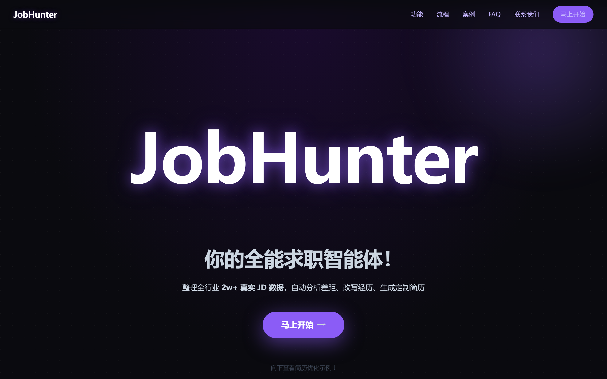
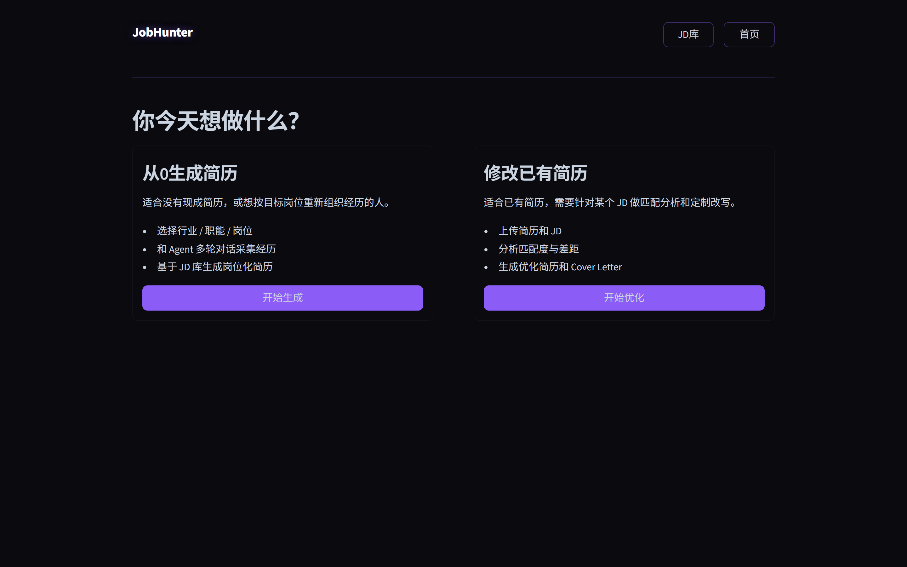
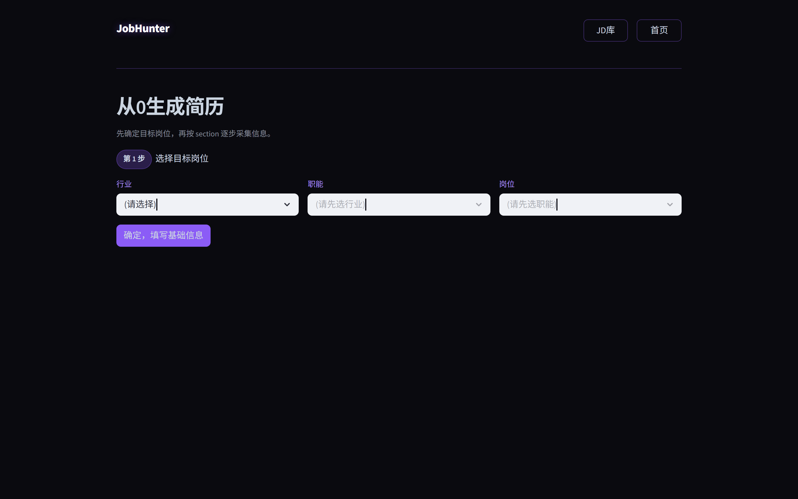
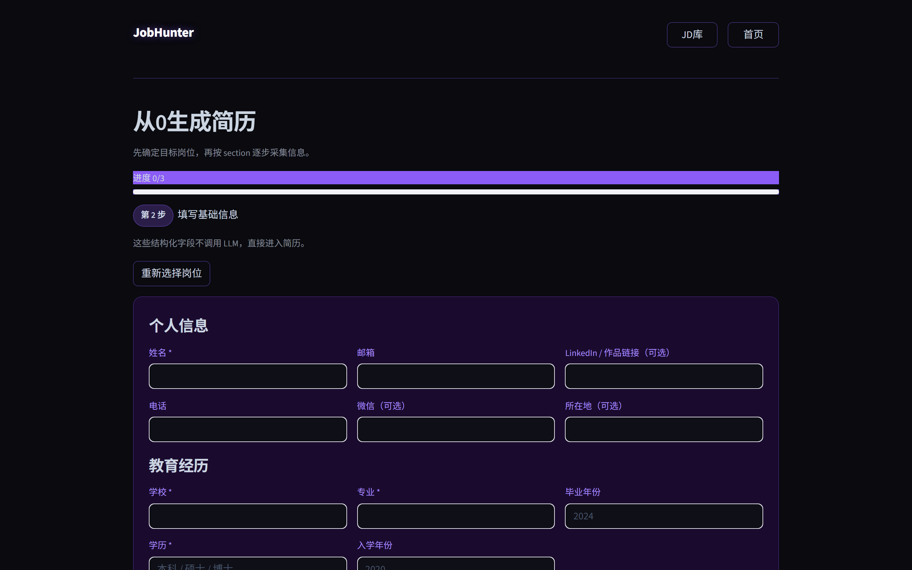
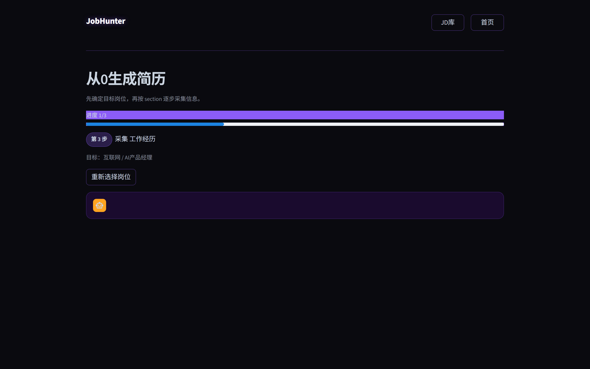
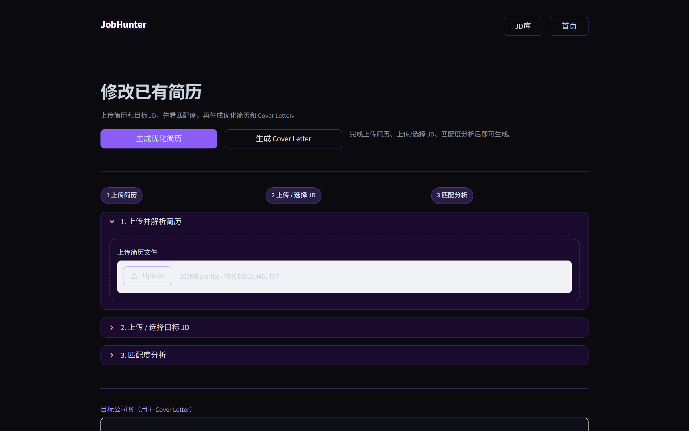
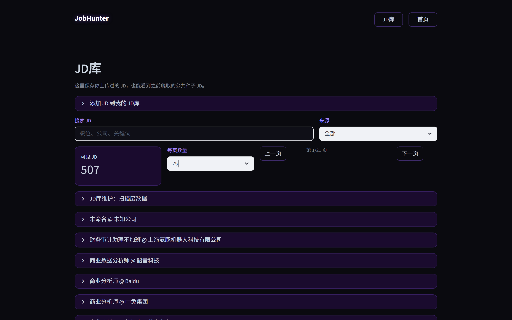
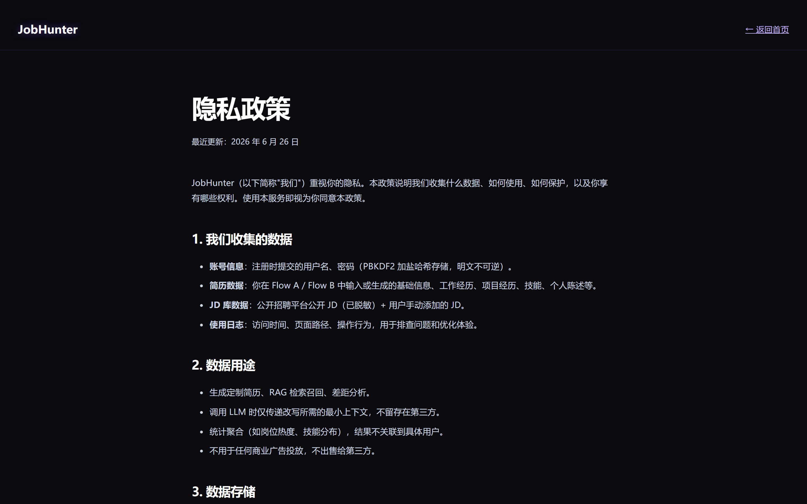
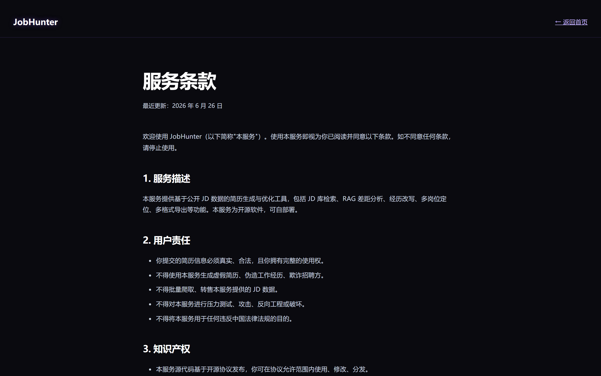

# JobHunter 产品需求文档（PRD）

> **版本**：v2.1 · **更新**：2026-06-26 · **状态**：M6 已交付，登录系统暂缓

---

## 1. 产品定位

**一句话**：基于 2w+ 真实 JD 库的 AI 简历生成与优化智能体，5 分钟产出岗位化定制简历。

**核心价值**：
- **不是模板填空**：用 RAG 从真实 JD 里反推岗位能力模型，再改写用户经历去对齐
- **不是 ChatGPT 套壳**：Agent 多轮对话采集经历 → 结构化 → 派生总结/核心能力 → 生成 HTML/PDF
- **不是一次性工具**：JD 库持续沉淀，用户每次生成的简历都反哺知识库

**目标用户**：
- 0-3 年产品/运营/数据岗位求职者，简历与目标 JD 匹配度低
- 转行者，原有经历与目标岗位看似无关，需要"翻译"成目标岗位语言
- 有不相关经历（如保险销售想转 AI 产品），需要 AI 包装向目标岗位靠拢

---

## 2. 核心流程

两条主线，覆盖从 0 生成和已有优化两种场景：

```
Flow A（从0生成）              Flow B（修改已有）
─────────────────             ─────────────────
选行业/职能/岗位                上传简历
    ↓                             ↓
填基础信息表单                  上传/选择 JD
    ↓                             ↓
Agent 多轮采集经历/项目         匹配度分析（差距 + 建议）
    ↓                             ↓
RAG 检索 JD 库                  生成优化简历 + Cover Letter
    ↓
改写经历 → 派生总结/能力
    ↓
生成 HTML / PDF / Markdown
```

---

## 3. 页面详解

### 3.1 首页 Hero（Landing）



**功能**：
- 品牌 + 价值主张 + 主 CTA"马上开始"
- 6 大能力卡片（JD 库 / RAG 差距分析 / 经历改写 / 多岗位定位 / 多格式导出 / 数据来源透明）
- 4 步流程图（选岗位 → 对话采集 → RAG 改写 → 导出）
- 案例展示（优化前/优化后对比）
- 数据指标（2w+ JD / 5 分钟 / 70% 效率提升）
- FAQ + 联系我们 + 页脚法律链接

**设计初衷**：
- **深紫黑紫霓虹配色**：区别于市面求职工具的蓝白配色，传递"AI 原生"而非"传统 HR SaaS"的定位
- **单页长滚动**：所有卖点上首页，避免用户点进二级页才发现功能不对路
- **CTA 指向 mode_select 而非登录**：登录系统暂缓，先让用户体验产品价值，降低流失

---

### 3.2 模式选择（Mode Select）



**功能**：
- 顶部导航：JobHunter 标题 / JD库 / 首页
- 两张大卡片：
  - **从0生成简历**：适合没有现成简历或想重新组织经历的人
  - **修改已有简历**：适合已有简历需要针对 JD 做匹配分析的人

**设计初衷**：
- **2 选 1 而非功能列表**：降低决策成本，用户进来 5 秒内能选
- **卡片而非按钮**：用 `st.container(border=True)` + hover 紫光晕，视觉上是"两个入口"而非"一堆按钮"
- **顶部导航精简到 3 个**：JD库 / 首页 / 标题，不堆功能

---

### 3.3 Flow A 第1步：选岗位



**功能**：
- 三级联动 selectbox：行业 → 职能 → 岗位
- 选完后点"确定，填写基础信息"进第2步
- 顶部进度条 + 步骤 pill（第 1 步）

**设计初衷**：
- **三级联动而非自由输入**：岗位名称标准化是 RAG 召回的前提，自由输入会导致"AI产品经理"和"AI 产品经理"召回不同结果
- **进度条 + step-pill**：让用户知道总共 4 步，当前在哪步，降低放弃率
- **岗位列表来自 `tools/taxonomy.py`**：可控的岗位字典，后续可扩展

---

### 3.4 Flow A 第2步：基础信息表单



**功能**：
- `st.form` 表单，分 3 块：个人信息 / 教育经历 / 技能与优势
- 必填校验：姓名、学校、学历、专业 / 电话和邮箱至少一项
- 保存后进第3步经历对话

**设计初衷**：
- **基础信息不调用 LLM**：姓名/电话/邮箱这些结构化字段直接进简历，省 token 也省时间
- **`st.form` 而非散装 input**：一次性提交，避免每个 input 都触发 rerun（streamlit 默认行为）
- **个人优势是自由文本**：用户写"3 年 B2C/B2B 产品经验"之类，后续 `derive_summary` 会基于它 + 经历派生简历总结

---

### 3.5 Flow A 第3步：经历对话



**功能**：
- Agent 自动发第一条消息，引导用户讲经历
- 多轮对话（最多 8 轮），LLM 流式输出
- 每轮 LLM 判断：继续问 / 本节完成 / 跳过
- 完成"经历"section 后进入"项目"section
- 跳过按钮 + 完成本节按钮

**设计初衷**：
- **对话式而非表单式**：用户写简历最痛苦的是"不知道写什么"，Agent 主动问"这段经历你最大的成果是什么？"比让用户对着空 input 想要强
- **8 轮上限**：避免无限对话，8 轮足够覆盖一段经历的背景/动作/结果/数据
- **流式输出**：`st.write_stream` + 线程/队列桥接 async LLM，让用户看到字一个个出来，而不是等 10 秒一次性弹出
- **force_close 机制**：LLM 觉得信息够了会主动结束本节，不让用户干等

---

### 3.6 Flow B：修改已有简历



**功能**：
- 3 个 expander：上传简历 / 上传或选择 JD / 匹配度分析
- JD 来源 4 选 1：粘贴 / PDF / JD库 / URL
- 匹配度分析输出：分数 + 推理 + 已匹配技能 / 缺失技能 / 优化建议
- 底部生成优化简历 + Cover Letter，可下载

**设计初衷**：
- **expander 而非分步**：Flow B 是线性流程，但用户可能想回去改 JD，expander 折叠/展开比"上一步/下一步"更灵活
- **JD 来源 4 选 1**：覆盖粘贴（最快）/ PDF（HR 发的）/ JD库（之前存过）/ URL（招聘页），不强迫用户转换格式
- **匹配度分析显式给推理过程**：不只给分数，还给"为什么这个分数"的 reasoning，让用户能自己判断要不要信

---

### 3.7 JD 库



**功能**：
- 添加 JD（粘贴 → 分析 → 入库）
- 搜索 + 来源筛选 + 分页（10/25/50 每页）
- 公共 JD badge（爬取种子库）vs 我的 JD badge（用户上传）
- 每条 JD 可"用于修改已有简历"（跳转 Flow B）/ 删除（仅自己的）
- JD库维护：扫描软删除登录页/验证码等废数据

**设计初衷**：
- **公共 JD + 私有 JD 混合展示**：用户上传的 JD 和爬取的种子 JD 都能看到，区别用 badge 标注
- **分页 + 搜索**：2w+ JD 不能一次渲染，分页 + 搜索是必须的
- **废数据治理**：爬虫会抓到登录页/验证码页，提供"扫描 + 软删除"工具而非自动删除（避免误删）

---

### 3.8 隐私政策 / 服务条款

  


**功能**：
- 静态 HTML 页面，深紫黑紫霓虹风格统一
- 隐私政策：数据收集 / 使用 / 存储 / 第三方服务 / 用户权利
- 服务条款：服务描述 / 用户责任 / 知识产权 / LLM 服务 / 数据隐私 / 免责声明

**设计初衷**：
- **静态 HTML 而非 Streamlit 页**：法律页面不需要交互，静态 HTML 加载快且 SEO 友好
- **风格与主站统一**：避免法律页是"白底黑字"而主站是深紫霓虹的割裂感

---

## 4. 技术架构

### 4.1 技术栈

| 层 | 选型 | 理由 |
|---|---|---|
| UI | Streamlit 1.44 + CSS 覆盖 | 单文件实现，`st.html` 直注 DOM，不用前端框架 |
| LLM | OpenAI 兼容协议（Agnes / 火山 / DeepSeek 可切） | provider-neutral，改 `.env` 不改代码 |
| RAG | BGE-small-zh + pgvector / sqlite-vec | 中文语义切分 + position 主过滤 + industry rerank |
| 爬虫 | playwright + 真人化节奏 | 遵守 robots.txt，CRAWLER_DAILY_LIMIT 限额 |
| PDF | playwright headless chromium | HTML → PDF，A4 排版 |

### 4.2 核心模块

```
web_app.py                  # Streamlit UI 单文件
agents/
  coordinator.py            # Flow B 协调器
  resume_flow_a.py          # Flow A 主体（对话 + 改写 + 派生）
tools/
  scraper/                  # 爬虫（JobsDB / Liepin / 51job）
  generator/                # 简历生成（HTML / Markdown / PDF）
  retriever.py              # RAG 检索
  llm.py                    # OpenAI 兼容 client
services/
  jd_library_service.py     # JD 库服务（公共/私有可见性）
  pdf_ingestion_service.py  # PDF JD 入库
database/
  backends/                 # SQLite / PostgreSQL 双后端
  classifier.py             # 行业/职能/岗位分类
```

### 4.3 数据流

```
用户选岗位 → RAG 检索 JD 库（position 主过滤）→ skeleton（岗位能力模型）
         ↓
用户对话采集 → Agent 多轮问 → 结构化提取
         ↓
经历改写（对齐 skeleton）→ 派生总结/核心能力 → 生成 HTML/MD/PDF
```

---

## 5. 设计原则

1. **第一性原理**：从"用户为什么要这份简历"出发，而非"简历模板长什么样"
2. **不做向后兼容 hack**：发现设计错误硬切，不留 alias / 废弃字段
3. **数据来源透明**：每份生成的简历底部标注"基于 N 份 JD chunk"，不让 AI 黑箱
4. **provider-neutral**：LLM / DB / 爬虫都是可替换的，不绑死任何一家
5. **测试驱动**：140 个 pytest 覆盖核心流程，CI 自动跑

---

## 6. 路线图

| 里程碑 | 状态 | 内容 |
|---|---|---|
| M1-M4 | ✅ 已交付 | RAG / 爬虫 / Flow A / Flow B 核心 |
| M5 | ✅ 已交付 | PostgreSQL + pgvector / LLM 质量埋点 |
| M6 | ✅ 已交付 | 批量 JD 预览 / AI chat widget / Liepin / Boss 登录检测 |
| 登录系统 | ⏸️ 暂缓 | 当前 anonymous user_id，后期加邮箱/微信/短信 provider |
| 51job scraper | 🚧 进行中 | 前程无忧 scraper（路径 1） |
| 猎聘放量 | 🚧 进行中 | 30 关键词 × 10 条，人类化节奏 |

---

## 7. 截图清单

所有截图由 `tools/screenshot/capture_pages.py` 自动生成，存于 `docs/screenshots/`：

| 文件 | 页面 |
|---|---|
| 01_landing.png | 首页 Hero |
| 02_mode_select.png | 模式选择 |
| 03_flow_a_step1_select.png | Flow A 第1步 选岗位 |
| 04_flow_a_step2_form.png | Flow A 第2步 基础信息 |
| 05_flow_a_step3_chat.png | Flow A 第3步 经历对话 |
| 06_flow_b.png | Flow B 修改简历 |
| 07_jd_library.png | JD 库 |
| 08_privacy.png | 隐私政策 |
| 09_terms.png | 服务条款 |

重新生成截图：
```bash
streamlit run web_app.py &  # 先启动
python tools/screenshot/capture_pages.py
```

---

## 8. 相关文档

- [CHANGELOG_v2.1.md](../CHANGELOG_v2.1.md) — 完整变更账本
- [README.md](../README.md) — 快速上手
- [CONTRIBUTING.md](../CONTRIBUTING.md) — 贡献者流程
